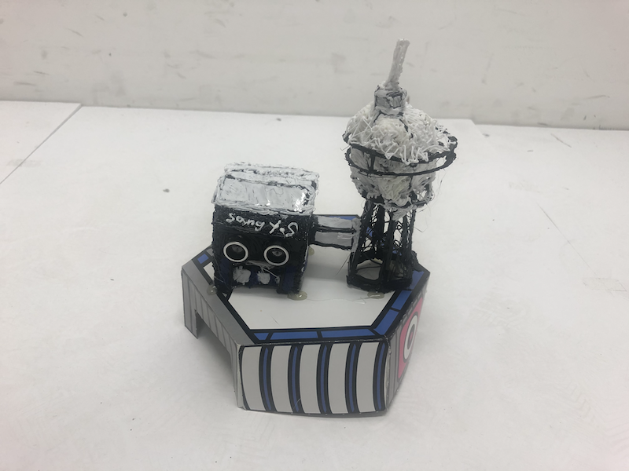
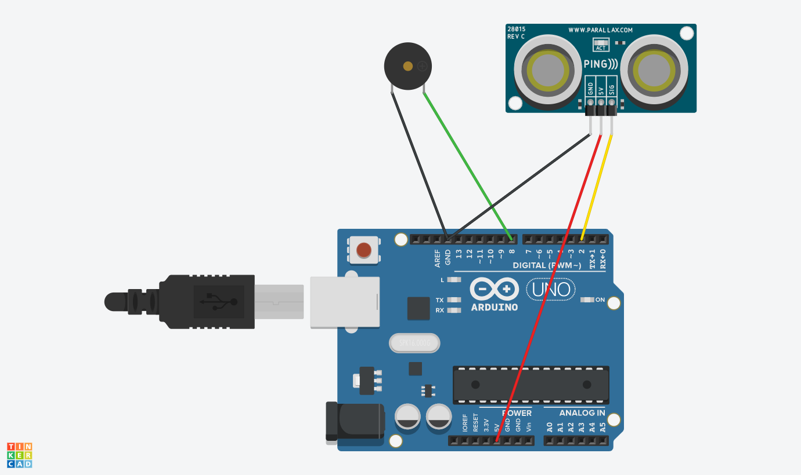
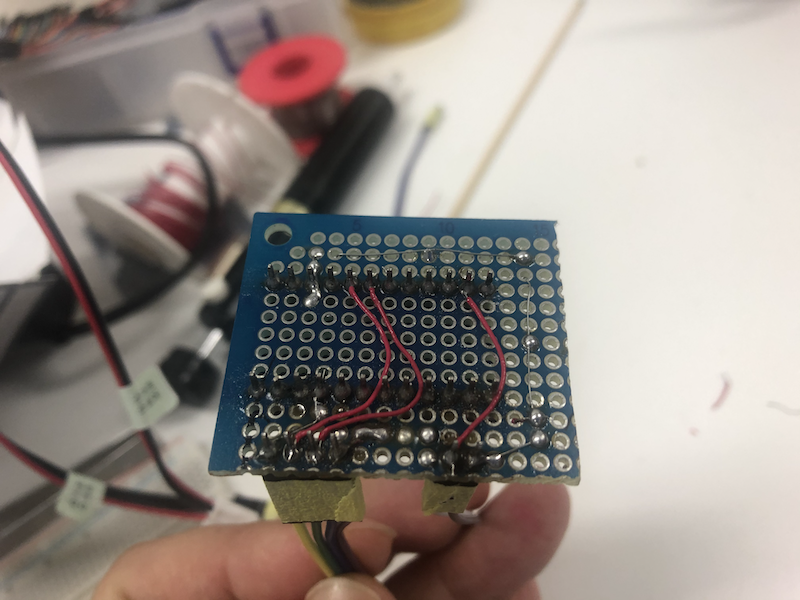
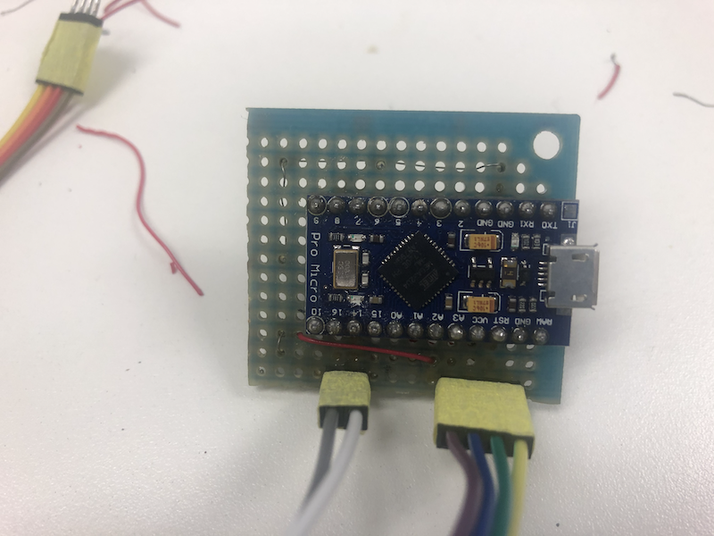

# 아두이노를 이용한 접근 경보기

### Intro

둘째 딸이 학교 방과후 수업(3D펜 수업)에서 작품을 만들어 왔는데,  
초음파센서하고 피에조가 붙어있길래 물어보니,  
아두이노를 붙여서 가까이 가면 소리나는 거라고 하더라.  

근데, 아두이노는 비싸서 같이 못준다고 껍데기만 집에 가져왔다.  



### 아빠가 만들어 줄께

아빠가 아두이노 붙여줄께..  

공구함에 쌓여있는 아두이노 하나 꺼내서 연결하고, 코딩하고..







배터리를 달아보려 했으나, 지금 가진 배터리 케이스나 커넥터가 없어서,  
Micro USB 케이블로 연결해서 쓸 수 있도록  
아두이노 micro USB / Leonardo 호환 보드를 이용해서 만들었다.

#### Arduino Code

```cpp
const int trig= 2;
const int echo= 3;
const int piezo = 8;

unsigned long nextBeepTime = 0;

void setup() {
}

void loop()
{
  long val= readUltrasonicDistance(trig, echo);

  unsigned long current = millis();
  
  if(val < 200) { //20cm 미터 이내
    if(current > nextBeepTime) {
      tone(piezo, 440, 100);
      nextBeepTime = millis() + val * 2;
    }
  }

  delay(50);
}

long readUltrasonicDistance(int triggerPin, int echoPin)
{
  pinMode(triggerPin, OUTPUT);  // Clear the trigger
  digitalWrite(triggerPin, LOW);
  delayMicroseconds(2);
  // Sets the trigger pin to HIGH state for 10 microseconds
  digitalWrite(triggerPin, HIGH);
  delayMicroseconds(10);
  digitalWrite(triggerPin, LOW);
  pinMode(echoPin, INPUT);
  // Reads the echo pin, and returns the sound wave travel time in microseconds
  return pulseIn(echoPin, HIGH) * 1723 / 10000; // mm
}
```

### 결과물

[](https://youtu.be/LTu5CMP1euM)  
Video


### Outro

아두이노 우노에다가 커넥커로 연결해주는게 편할텐데,  
우노는 1개밖에 없어서 소모하긴 싫고, 커넥터도 마땅한게 없어서,  
마이크로 버전에다가 회로 꾸미다 보니 복잡하게 된 듯 하지만,  
결과는 잘 나왔다.

### Devices

**[Arduino](https://www.aliexpress.com/item/32808519179.html?spm=a2g0s.9042311.0.0.1cc84c4diZaUdG)**  
Pro Micro ATmega32U4 5V 16MHz Replace ATmega328 For arduino ATMega 32U4 Pro Mini With 2 Row Pin Header

**[HC-SR04](https://www.aliexpress.com/item/32786781050.html?spm=a2g0o.productlist.0.0.85a14691dQMdky&algo_pvid=5a227560-30e6-450c-8347-0f5516e9c16d&algo_expid=5a227560-30e6-450c-8347-0f5516e9c16d-0&btsid=41d37a9e-644a-4a9d-9e3f-03e9aa78f87d&ws_ab_test=searchweb0_0,searchweb201602_5,searchweb201603_55)**  
Ultrasonic Wave Detector Ranging Module for arduino Distance Sensor

**[Piezo](https://www.aliexpress.com/item/4000148640191.html?spm=a2g0o.productlist.0.0.6feb35587gTgcD&algo_pvid=ed4ad6d5-79ac-4c41-993f-177ca5bcc8c9&algo_expid=ed4ad6d5-79ac-4c41-993f-177ca5bcc8c9-10&btsid=d3b9c022-e46c-4b85-9337-f2a19cd9bccf&ws_ab_test=searchweb0_0,searchweb201602_5,searchweb201603_55)**  
Mini Piezo Buzzers For Arduino
